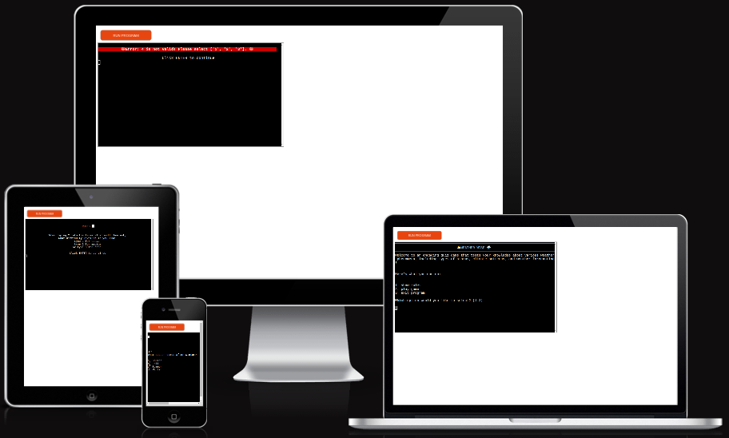
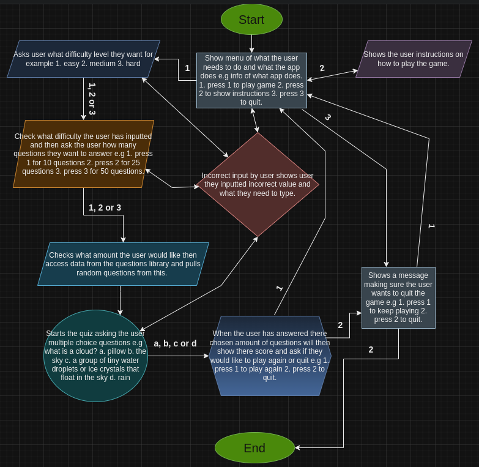

# [WEATHER WISE](https://weather-wise-project-e6ccd7a6b753.herokuapp.com)

[](https://github.com/AshLaw96/weather-wise/commits/main)
[](https://github.com/AshLaw96/weather-wise/commits/main)
[](https://github.com/AshLaw96/weather-wise)

---

Weather Wise is a weather quiz that users can play to help improve there knowledge about weather and is a fun game for all ages.

When a user first opens the quiz it will show a menu with a title and a brief overview of what it actually is. Below this it will then show a list of options with what the user would like to do next. Depending on there choice it will either start the game, show the instructions on how to play the game or quit the game. If the user inputs an incorrect value they will then be informed that whatever they have just inputted was incorrect and they need to write either 1, 2 or 3 depending on there choice. With the first option been chosen, it will then ask the user what level of difficulty the user would like for example easy, medium or hard. Again if the user inputs an incorrect value it will tell them that they have done so and need to write either 1, 2 or 3. Following there choice it will then ask how many questions they would like to answer for example 10, 25 or 50. Once more if the user didn't type a correct value it will tell them so and that they need to type either 1, 2 or 3. After this the app will then access data from the questions library and start asking randomly chosen multiple choice questions up until the user has answered there desired amount, for example what is rain? a. god peeing b. condensation from clouds c. water squirting from plains d. water that falls from clouds in the sky, that happens when tiny water droplets in the clouds join together and become too heavy to stay in the air. Once again if the user doesn't input a, b, c or d for any question they will be told to write a correct value from the options given. When the quiz has been finished there score will be toted up and then shown to the user, then the user will be asked if they would like to play again or quit the game. If the user doesn't input a correct value again they will be informed of this and asked to input a correct value. Providing they have chosen a correct value it will either take them to the menu or show message saying thank you for playing, goodbye. However at the menu screen if the user inputted the second option the app will then show the user how to play the quiz and once they have read this it will ask if they want to play again. Finally if the user chose the last option it will then double check they want to quit and if they do show the thank you for playing, goodbye message. 

Deployed site:
https://ui.dev/amiresponsive?url=https://weather-wise-project-e6ccd7a6b753.herokuapp.com



source: [amiresponsive](https://ui.dev/amiresponsive?url=https://weather-wise-project-e6ccd7a6b753.herokuapp.com)

---

## User Stories

### New Site Users

- As a new site user, I would like to enter any location I want, so that I can quickly find what the weather will be like in that location.
- As a new site user, I would like to know what my current locations weather is going to be, so that I can decide what I need to wear.
- As a new site user, I would like to know if it's going to rain, so that I can decide what I'm going to do.
- As a new site user, I would like to know what the temperature is going to be, so that I can decide whether or not to go for a run.
- As a new site user, I would like to know if it's going to be sunny at the seaside, so that I can find out if I can take my family to the beach.

### Returning Site Users

- As a returning site user, I would like to quickly find out what the weather will be like in different places, so that I can decide where I would prefer to go.
- As a returning site user, I would like to be able to search what the weather is going to be like in 2 different locations, so that I can compare each place.
- As a returning site user, I would like to have clear instructions on how to use the app, so that I can easily understand what to do with the app.
- As a returning site user, I would like to know when the sun set and rises, so that I can be on time to view it.
- As a returning site user, I would like to see weather condition icons, so that I can better visualise what the weather will be like.

## Flowchart

To follow best practice, a flowchart was developed to show the plan of the app and how it should work. I used [Draw.io](https://app.diagrams.net/) to design my apps flowchart.



## Features

### Existing Features

- **Header section**

  - This will show the user what the app is called and a brief explanation of what it actually does.  


- **Asks user question**

  - The app will first ask the user if they would like to input a location or if they would like to use there current location.


- **Find users current location or ask user to input a location**

  - Depending on the users previous answer the app will either ask the user to input a location or try to locate where the user is based.


- **Check users input is correct**

  - The app will make sure the user has inputted a valid location, if not an error will appear letting the user know that there input is incorrect and will have to try again. However if the user is correct the app will then request a library to send an API call to a external weather website and pull data from this. 

<details>
<summary> Click here to view the input checks </summary>

Correct input


Incorrect input


</details>

- **Users location**

  - If the user chose to allow the app to access the users current location the app will then process this and if successful will use it to access data from an external weather website by requesting a library to send an API call to this site. However if the app cannot find the users location, it will show an error message informing the user of this and will then ask if they would like to try again or input there own location.

<details>
<summary> Click here to view the location checks </summary>

Correct input


Incorrect input


</details>

- **Show dictionary of key value pairs**

  - The app will then show the user a variety of weather information, informing the user of the weather of there chosen location.


### Future Features

1. Allow user to input 2 locations at the same time so they can compare the weather easily.
2. Add icons of different weather conditions for a more visually pleasing weather app.

## Tools & Technologies Used

- [](https://tim.2bn.dev/markdown-builder) used to generate README and TESTING templates.
- [](https://git-scm.com) used for version control. (`git add`, `git commit`, `git push`)
- [](https://github.com) used for secure online code storage.
- [](https://gitpod.io) used as a cloud-based IDE for development.
- [](https://www.python.org) used as the back-end programming language.
- [](https://www.heroku.com) used for hosting the deployed back-end site.
- ⚠️⚠️ MISCELLANEOUS: CHOOSE ALL APPLICABLE <-- delete me ⚠️⚠️
- [](https://docs.google.com/spreadsheets) used for storing data from my Python app.
- [](https://jestjs.io) used for automated JavaScript testing.
- [](https://flask.palletsprojects.com) used as the Python framework for the site.
- [](https://www.mongodb.com) used as the non-relational database management with Flask.
- [](https://www.sqlalchemy.org) used as the relational database management with Flask.
- [](https://www.djangoproject.com) used as the Python framework for the site.
- [](https://www.postgresql.org) used as the relational database management.
- [](https://dbs.ci-dbs.net) used as the Postgres database from Code Insti
- [](https://whitenoise.readthedocs.io) used for serving static files with Heroku.

- [](https://chat.openai.com) used to help debug, troubleshoot, and explain things.

## Data Model

### Flowchart

To follow best practice, a flowchart was created for the app's logic,
and mapped out before coding began using a free version of
[Lucidchart](https://www.lucidchart.com/pages/ER-diagram-symbols-and-meaning) and/or [Draw.io](https://www.draw.io).

Below is the flowchart of the main process of this Python program. It shows the entire cycle of the program.


### Classes & Functions

The program uses classes as a blueprint for the project's objects (OOP). This allows for the object to be reusable.

```python
class Person:
    """ Insert docstring comments here """
    def __init__(self, name, age, health, inventory):
        self.name = name
        self.age = age
        self.health = health
        self.inventory = inventory
```

The primary functions used on this application are:

- `get_sales_data()`
    - Get sales figures input from the user.
- `validate_data()`
    - Converts all string values into integers.
- `update_worksheet()`
    - Update the relevant worksheet with the data provided.
- `calculate_surplus_data()`
    - Compare sales with stock and calculate the surplus for each item type.
- `get_last_5_entries_sales()`
    - Collects columns of data from sales worksheet.
- `calculate_stock_data()`
    -  Calculate the average stock for each item type, adding 10%.
- `main()`
    - Run all program functions.

### Imports

I've used the following Python packages and/or external imported packages.

- `gspread`: used with the Google Sheets API
- `google.oauth2.service_account`: used for the Google Sheets API credentials
- `time`: used for adding time delays
- `os`: used for adding a `clear()` function
- `colorama`: used for including color in the terminal
- `random`: used to get a random choice from a list

## Testing

> [!NOTE]  
> For all testing, please refer to the [TESTING.md](TESTING.md) file.

## Deployment

Code Institute has provided a [template](https://github.com/Code-Institute-Org/python-essentials-template) to display the terminal view of this backend application in a modern web browser.
This is to improve the accessibility of the project to others.

The live deployed application can be found deployed on [Heroku](https://weather-wise-project-e6ccd7a6b753.herokuapp.com).

### Heroku Deployment

This project uses [Heroku](https://www.heroku.com), a platform as a service (PaaS) that enables developers to build, run, and operate applications entirely in the cloud.

Deployment steps are as follows, after account setup:

- Select **New** in the top-right corner of your Heroku Dashboard, and select **Create new app** from the dropdown menu.
- Your app name must be unique, and then choose a region closest to you (EU or USA), and finally, select **Create App**.
- From the new app **Settings**, click **Reveal Config Vars**, and set the value of KEY to `PORT`, and the value to `8000` then select *add*.
- If using any confidential credentials, such as CREDS.JSON, then these should be pasted in the Config Variables as well.
- Further down, to support dependencies, select **Add Buildpack**.
- The order of the buildpacks is important, select `Python` first, then `Node.js` second. (if they are not in this order, you can drag them to rearrange them)

Heroku needs three additional files in order to deploy properly.

- requirements.txt
- Procfile
- runtime.txt

You can install this project's **requirements** (where applicable) using:

- `pip3 install -r requirements.txt`

If you have your own packages that have been installed, then the requirements file needs updated using:

- `pip3 freeze --local > requirements.txt`

The **Procfile** can be created with the following command:

- `echo web: node index.js > Procfile`

The **runtime.txt** file needs to know which Python version you're using:
1. type: `python3 --version` in the terminal.
2. in the **runtime.txt** file, add your Python version:
	- `python-3.9.19`

For Heroku deployment, follow these steps to connect your own GitHub repository to the newly created app:

Either:

- Select **Automatic Deployment** from the Heroku app.

Or:

- In the Terminal/CLI, connect to Heroku using this command: `heroku login -i`
- Set the remote for Heroku: `heroku git:remote -a app_name` (replace *app_name* with your app name)
- After performing the standard Git `add`, `commit`, and `push` to GitHub, you can now type:
	- `git push heroku main`

The frontend terminal should now be connected and deployed to Heroku!

### Local Deployment

This project can be cloned or forked in order to make a local copy on your own system.

For either method, you will need to install any applicable packages found within the *requirements.txt* file.

- `pip3 install -r requirements.txt`.

If using any confidential credentials, such as `CREDS.json` or `env.py` data, these will need to be manually added to your own newly created project as well.

#### Cloning

You can clone the repository by following these steps:

1. Go to the [GitHub repository](https://github.com/AshLaw96/weather-wise) 
2. Locate the Code button above the list of files and click it 
3. Select if you prefer to clone using HTTPS, SSH, or GitHub CLI and click the copy button to copy the URL to your clipboard
4. Open Git Bash or Terminal
5. Change the current working directory to the one where you want the cloned directory
6. In your IDE Terminal, type the following command to clone my repository:
	- `git clone https://github.com/AshLaw96/weather-wise.git`
7. Press Enter to create your local clone.

Alternatively, if using Gitpod, you can click below to create your own workspace using this repository.

[](https://gitpod.io/#https://github.com/AshLaw96/weather-wise)

Please note that in order to directly open the project in Gitpod, you need to have the browser extension installed.
A tutorial on how to do that can be found [here](https://www.gitpod.io/docs/configure/user-settings/browser-extension).

#### Forking

By forking the GitHub Repository, we make a copy of the original repository on our GitHub account to view and/or make changes without affecting the original owner's repository.
You can fork this repository by using the following steps:

1. Log in to GitHub and locate the [GitHub Repository](https://github.com/AshLaw96/weather-wise)
2. At the top of the Repository (not top of page) just above the "Settings" Button on the menu, locate the "Fork" Button.
3. Once clicked, you should now have a copy of the original repository in your own GitHub account!

### Local VS Deployment

🛑🛑🛑🛑🛑🛑🛑🛑🛑🛑-START OF NOTES (to be deleted)

Use this space to discuss any differences between the local version you've developed, and the live deployment site on Heroku.

🛑🛑🛑🛑🛑🛑🛑🛑🛑🛑-END OF NOTES (to be deleted)

## Credits

🛑🛑🛑🛑🛑🛑🛑🛑🛑🛑-START OF NOTES (to be deleted)

In this section you need to reference where you got your content, media, and extra help from.
It is common practice to use code from other repositories and tutorials,
however, it is important to be very specific about these sources to avoid plagiarism.

🛑🛑🛑🛑🛑🛑🛑🛑🛑🛑-END OF NOTES (to be deleted)

### Content

🛑🛑🛑🛑🛑🛑🛑🛑🛑🛑-START OF NOTES (to be deleted)

Use this space to provide attribution links to any borrowed code snippets, elements, or resources.
A few examples have been provided below to give you some ideas.

Ideally, you should provide an actual link to every resource used, not just a generic link to the main site!

⚠️⚠️ EXAMPLE LINKS - REPLACE WITH YOUR OWN ⚠️⚠️

🛑🛑🛑🛑🛑🛑🛑🛑🛑🛑-END OF NOTES (to be deleted)

| Source | Location | Notes |
| --- | --- | --- |
| [Markdown Builder](https://tim.2bn.dev/markdown-builder) | README and TESTING | tool to help generate the Markdown files |
| [Chris Beams](https://chris.beams.io/posts/git-commit) | version control | "How to Write a Git Commit Message" |
| [W3Schools](https://www.w3schools.com/howto/howto_js_topnav_responsive.asp) | entire site | responsive HTML/CSS/JS navbar |
| [W3Schools](https://www.w3schools.com/howto/howto_css_modals.asp) | contact page | interactive pop-up (modal) |
| [W3Schools](https://www.w3schools.com/css/css3_variables.asp) | entire site | how to use CSS :root variables |
| [Flexbox Froggy](https://flexboxfroggy.com/) | entire site | modern responsive layouts |
| [Grid Garden](https://cssgridgarden.com) | entire site | modern responsive layouts |
| [StackOverflow](https://stackoverflow.com/a/2450976) | quiz page | Fisher-Yates/Knuth shuffle in JS |
| [YouTube](https://www.youtube.com/watch?v=YL1F4dCUlLc) | leaderboard | using `localStorage()` in JS for high scores |
| [YouTube](https://www.youtube.com/watch?v=u51Zjlnui4Y) | PP3 terminal | tutorial for adding color to the Python terminal |
| [strftime](https://strftime.org) | CRUD functionality | helpful tool to format date/time from string |
| [WhiteNoise](http://whitenoise.evans.io) | entire site | hosting static files on Heroku temporarily |

### Media

🛑🛑🛑🛑🛑🛑🛑🛑🛑🛑-START OF NOTES (to be deleted)

Use this space to provide attribution links to any images, videos, or audio files borrowed from online.
A few examples have been provided below to give you some ideas.

If you're the owner (or a close acquaintance) of all media files, then make sure to specify this.
Let the assessors know that you have explicit rights to use the media files within your project.

Ideally, you should provide an actual link to every media file used, not just a generic link to the main site!
The list below is by no means exhaustive. Within the Code Institute Slack community, you can find more "free media" links
by sending yourself the following command: `!freemedia`.

⚠️⚠️ EXAMPLE LINKS - REPLACE WITH YOUR OWN ⚠️⚠️

🛑🛑🛑🛑🛑🛑🛑🛑🛑🛑-END OF NOTES (to be deleted)

| Source | Location | Type | Notes |
| --- | --- | --- | --- |
| [Pexels](https://www.pexels.com) | entire site | image | favicon on all pages |
| [Lorem Picsum](https://picsum.photos) | home page | image | hero image background |
| [Unsplash](https://unsplash.com) | product page | image | sample of fake products |
| [Pixabay](https://pixabay.com) | gallery page | image | group of photos for gallery |
| [Wallhere](https://wallhere.com) | footer | image | background wallpaper image in the footer |
| [This Person Does Not Exist](https://thispersondoesnotexist.com) | testimonials | image | headshots of fake testimonial images |
| [Audio Micro](https://www.audiomicro.com/free-sound-effects) | game page | audio | free audio files to generate the game sounds |
| [Videvo](https://www.videvo.net/) | home page | video | background video on the hero section |
| [TinyPNG](https://tinypng.com) | entire site | image | tool for image compression |

### Acknowledgements

🛑🛑🛑🛑🛑🛑🛑🛑🛑🛑-START OF NOTES (to be deleted)

Use this space to provide attribution to any supports that helped, encouraged, or supported you throughout the development stages of this project.
A few examples have been provided below to give you some ideas.

⚠️⚠️ EXAMPLES ONLY - REPLACE WITH YOUR OWN ⚠️⚠️

🛑🛑🛑🛑🛑🛑🛑🛑🛑🛑-END OF NOTES (to be deleted)

- I would like to thank my Code Institute mentor, [Tim Nelson](https://github.com/TravelTimN) for his support throughout the development of this project.
- I would like to thank the [Code Institute](https://codeinstitute.net) tutor team for their assistance with troubleshooting and debugging some project issues.
- I would like to thank the [Code Institute Slack community](https://code-institute-room.slack.com) for the moral support; it kept me going during periods of self doubt and imposter syndrome.
- I would like to thank my partner (John/Jane), for believing in me, and allowing me to make this transition into software development.
- I would like to thank my employer, for supporting me in my career development change towards becoming a software developer.
