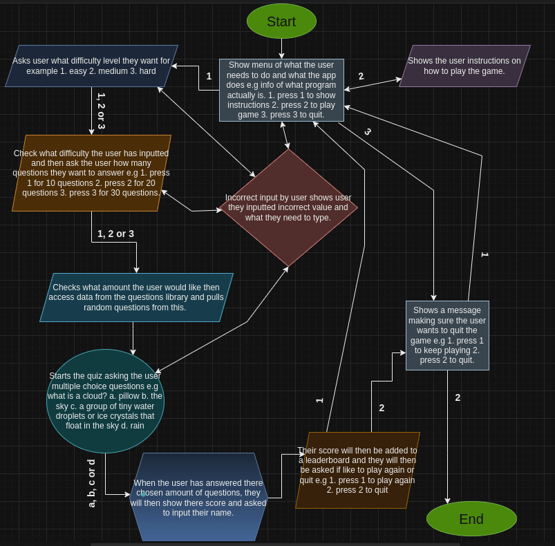

# [WEATHER WISE](https://weather-wise-project-e6ccd7a6b753.herokuapp.com)

[](https://github.com/AshLaw96/weather-wise/commits/main)
[](https://github.com/AshLaw96/weather-wise/commits/main)
[](https://github.com/AshLaw96/weather-wise)

---

Weather Wise is a multiple choice weather quiz that users can play to help improve there knowledge about weather and is a fun game for all ages, so everyone can play.

When a user first opens the quiz it will show a menu with a title and a brief overview of what it actually is. Below this it will then show a list of options with what the user would like to do next. Depending on there choice it will either start the game, show the instructions on how to play the game or quit the game. If the user inputs an incorrect value they will then be informed that whatever they have just inputted was incorrect and they need to write either 1, 2 or 3 depending on there choice. With the first option been chosen, it will then ask the user what level of difficulty the user would like for example easy, medium or hard. Again if the user inputs an incorrect value it will tell them that they have done so and need to write either 1, 2 or 3. Following there choice it will then ask how many questions they would like to answer for example 10, 25 or 50. Once more if the user didn't type a correct value it will tell them so and that they need to type either 1, 2 or 3. After this the app will then access data from the questions library and start asking randomly chosen multiple choice questions up until the user has answered there desired amount, for example what is rain? a. god peeing b. condensation from clouds c. water squirting from plains d. water that falls from clouds in the sky, that happens when tiny water droplets in the clouds join together and become too heavy to stay in the air. Once again if the user doesn't input a, b, c or d for any question they will be told to write a correct value from the options given. When the quiz has been finished there score will be toted up and then shown to the user, then the user will be asked if they would like to play again or quit the game. If the user doesn't input a correct value again they will be informed of this and asked to input a correct value. Providing they have chosen a correct value it will either take them to the menu or show message saying thank you for playing, goodbye. However at the menu screen if the user inputted the second option the app will then show the user how to play the quiz and once they have read this it will ask if they want to play again. Finally if the user chose the last option it will then double check they want to quit and if they do show the thank you for playing, goodbye. 

Deployed site:
https://ui.dev/amiresponsive?url=https://weather-wise-project-e6ccd7a6b753.herokuapp.com


source: [amiresponsive](https://ui.dev/amiresponsive?url=https://weather-wise-project-e6ccd7a6b753.herokuapp.com)

---

## User Stories

### New Site Users

- As a new site user, I would like to be able to know what the program does, so that I can quickly decide if I want to continue.
- As a new site user, I would like to know how to play the quiz, so that I can easily understand what I need to do and start playing.
- As a new site user, I would like to choose how hard the quiz is, so that I can challenge myself with harder questions.
- As a new site user, I would like to choose the amount of questions I get asked, so that I don't get bored.
- As a new site user, I would like to keep playing the game as many times as I want, so that I can keep learning interesting facts about the weather.

### Returning Site Users

- As a returning site user, I would like to be able to try answering any question again if I didn't input one of the given options, so that my score isn't effected because of this.
- As a returning site user, I would like to be able to see my high score, so that I can try and beat it and improve my knowledge.
- As a returning site user, I would like to have different questions asked, so that I'm not repeating the same questions every time I play.
- As a returning site user, I would like to see different icons or images, so that I can be visually pleased whilst learning cool facts at the same time.
- As a returning site user, I would like to see other peoples high score, so that I can try and get on the top of the leaderboard.

## Features

### Existing Features

- **Header section**

  - This will show the user what the app is called and a brief explanation of what it actually does.  


- **Menu options**

  - The app will then show three options 1. Play quiz 2. How to play 3. Quit. The user will then be asked to either input 1, 2 or 3 depending on what they would like to do.


- **Incorrect input for menu**

  - If the user inputted an incorrect value the app will show that there value was not correct and the need to input either 1, 2 or 3.


- **Option 1**

  - The app will then ask the user what difficulty level they would like. 1. Easy 2. Medium 3. Hard. The user will then be asked to input either 1, 2 or 3. 

<details>
<summary> Click here to view the difficulties </summary>

Easy input


Medium input


Hard input


</details>

- **Incorrect option 1 choice**

  - If the user choose an option that wasn't there they will be informed that there value was incorrect and that they would need to type either 1, 2 or 3.


- **Option 1 part 2**

  - Once the user has chosen there difficulty they will then be asked how many questions they will like to be asked, 1. 10 2. 25 3. 50


- **Incorrect option 1 part 2**

  - If the user choose an option that wasn't there they will be informed that there value was incorrect and that they would need to type either 1, 2 or 3.


- **Option 2**

  - The app will show the user instructions on how to play the game and once they have read the rules ask them if they have finished reading if they have it will take them back to the menu if not it will just ask the question again.


- **Incorrect option 2 choice**

  - If the user typed an incorrect value they will be informed that there value was incorrect and that they would need to type either Y/y or N/n.


- **Option 3**

  - The app will ask the user if they are sure they want to quit, if they do it will show a message saying thankyou for playing, goodbye, if not it will return them to the menu.

<details>
<summary> Click here to view the quit options </summary>

Y/y input


N/n input


</details>

- **Incorrect option 3 choice**

  - If the user typed an incorrect value they will be informed that there value was incorrect and that they would need to type either Y/y or N/n.


- **The quiz**

  - When the player has chosen there difficulty level and how many questions they would like to answer, the app will then access the questions library and choose data from the chosen level and pick random question from it and start asking the user until there chosen amount has been completed.


- **Incorrect value for quiz**

  - If the user inputs an incorrect value they will be shown that there input is incorrect and they must type either A/a, B/b, C/c or D/d.


- **Score**

  - When the user has finished the quiz there score will be toted up and then printed to the screen showing them what they have achieved.


- **Finished**

  - Once the user has received there score they will then be asked if they would like to 1. play again or 2. quit, if they chose option 1 it will take the back to the menu if they chose option 2 it will then ask again if they are sure they would like to quit and if not it will take them to the menu but if they do it will show them the message thankyou for playing, goodbye.

<details>
<summary> Click here to view the finished game options </summary>

option 1


option 2


</details>

- **Incorrect value at finish**

  - If the user inputs an incorrect value they will be shown that there input is incorrect and they must type either 1 or 2 if they chose option 2 and then input an incorrect value for this it will show another error message saying this is an incorrect value you must type either Y/y or N/n.

<details>
<summary> Click here to view the finish error options </summary>

Error 1


Error 2


</details>

### Future Features

1. Allow users to play split-screen or multiplayer.
2. Add a leaderboard to save users high score.
3. Add links to other quizzes or cool facts about weather. 

## Tools & Technologies Used

- [](https://tim.2bn.dev/markdown-builder) used to generate README and TESTING templates.
- [](https://git-scm.com) used for version control. (`git add`, `git commit`, `git push`)
- [](https://github.com) used for secure online code storage.
- [](https://gitpod.io) used as a cloud-based IDE for development.
- [](https://www.python.org) used as the back-end programming language.
- [](https://www.heroku.com) used for hosting the deployed back-end site.
- [](https://docs.google.com/spreadsheets) used for storing data from my Python program for the leaderboard.
- [](https://chat.openai.com) used to help generate weather questions.
- [](https://www.draw.io) used for creating the flowchart of the Python program.

## Data Model

### Flowchart

To follow best practice, a flowchart was created for the app's logic,
and mapped out before coding began using a free version of
[Draw.io](https://www.draw.io).

Below is the flowchart of the main process of this Python program. It shows the entire cycle of the program.



### Classes & Functions

The program uses classes as a blueprint for the project's objects (OOP). This allows for the object to be reusable.

🛑🛑🛑🛑🛑🛑🛑🛑🛑🛑-START OF NOTES (to be deleted)

```python
class Person:
    """ Insert docstring comments here """
    def __init__(self, name, age, health, inventory):
        self.name = name
        self.age = age
        self.health = health
        self.inventory = inventory
```
🛑🛑🛑🛑🛑🛑🛑🛑🛑🛑-END OF NOTES (to be deleted)

The primary functions used on this application are:

- `menu()`
  - Shows the first screen the user sees allowing them to choose what they want to do first.
- `header()`
  - Shows the title and all of its styles and content.
- `checker()`
  - Adds code validation for the menu section if a user inputs incorrect values.
- `remove()`
  - Clears the content allowing user to see what's running next.
- `rules()`
  - Shows how to play the game and adds all of it's styling for this section.
- `exit()`
  - Allows the user to end the game and all the styling for this section.
- `exit_checker()`
  - Adds code validation for the exit section if a user inputs incorrect values.
- `level_selector()`
  - Let's the user choose what level of difficulty they would like the questions to be and adds styling for this section.
- `level_checker()`
  - Adds code validation for the level section if a user inputs incorrect values.
- `questions_amount()`
  - Let's the user choose how many questions they would like to answer and adds styling for this section.
- `amount_checker()`
  - Adds code validation for the amount section if a user inputs incorrect values.
- `random_questions()`
  - Selects the chosen amount and difficulty of questions the user asked for and randomly picks from the specified category and adds the styling.
-  `qst_checker()`
  - Adds code validation for the question section if a user inputs incorrect values.
- `next_qst()`
  - Brings up the next question and checks if the user is correct or not.
- `user_answered_select()`
  - Shows the questions and choices and makes sure the user inputted correctly and if not informs them.
- `auth_g_sheets()`
  - Sets up Google Sheets API and returns the correct worksheet based on difficulty.
- `update_leaderboard()`
  - Updates the Google Sheets leaderboard with the user's name, score, amount of questions answered and the time/date.
- `main()`
    - Run all program functions.

### Imports

I've used the following Python packages and/or external imported packages.

- `gspread`: used with the Google Sheets API
- `google.oauth2.service_account`: used for the Google Sheets API credentials
- `time`: used for adding time delays
- `os`: used for adding a `remove()` function
- `colorama`: used for including color in the terminal
- `random`: used to get a random choice from a list
- `questions`: used to pull all the questions from my own made file 

## Testing

> [!NOTE]  
> For all testing, please refer to the [TESTING.md](TESTING.md) file.

## Deployment

Code Institute has provided a [template](https://github.com/Code-Institute-Org/python-essentials-template) to display the terminal view of this backend application in a modern web browser.
This is to improve the accessibility of the project to others.

The live deployed application can be found deployed on [Heroku](https://weather-wise-project-e6ccd7a6b753.herokuapp.com).

### Heroku Deployment

This project uses [Heroku](https://www.heroku.com), a platform as a service (PaaS) that enables developers to build, run, and operate applications entirely in the cloud.

Deployment steps are as follows, after account setup:

- Select **New** in the top-right corner of your Heroku Dashboard, and select **Create new app** from the dropdown menu.
- Your app name must be unique, and then choose a region closest to you (EU or USA), and finally, select **Create App**.
- From the new app **Settings**, click **Reveal Config Vars**, and set the value of KEY to `PORT`, and the value to `8000` then select *add*.
- If using any confidential credentials, such as CREDS.JSON, then these should be pasted in the Config Variables as well.
- Further down, to support dependencies, select **Add Buildpack**.
- The order of the buildpacks is important, select `Python` first, then `Node.js` second. (if they are not in this order, you can drag them to rearrange them)

Heroku needs three additional files in order to deploy properly.

- requirements.txt
- Procfile
- runtime.txt

You can install this project's **requirements** (where applicable) using:

- `pip3 install -r requirements.txt`

If you have your own packages that have been installed, then the requirements file needs updated using:

- `pip3 freeze --local > requirements.txt`

The **Procfile** can be created with the following command:

- `echo web: node index.js > Procfile`

The **runtime.txt** file needs to know which Python version you're using:
1. type: `python3 --version` in the terminal.
2. in the **runtime.txt** file, add your Python version:
	- `python-3.9.19`

For Heroku deployment, follow these steps to connect your own GitHub repository to the newly created app:

Either:

- Select **Automatic Deployment** from the Heroku app.

Or:

- In the Terminal/CLI, connect to Heroku using this command: `heroku login -i`
- Set the remote for Heroku: `heroku git:remote -a app_name` (replace *app_name* with your app name)
- After performing the standard Git `add`, `commit`, and `push` to GitHub, you can now type:
	- `git push heroku main`

The frontend terminal should now be connected and deployed to Heroku!

### Local Deployment

This project can be cloned or forked in order to make a local copy on your own system.

For either method, you will need to install any applicable packages found within the *requirements.txt* file.

- `pip3 install -r requirements.txt`.

If using any confidential credentials, such as `CREDS.json` or `env.py` data, these will need to be manually added to your own newly created project as well.

#### Cloning

You can clone the repository by following these steps:

1. Go to the [GitHub repository](https://github.com/AshLaw96/weather-wise) 
2. Locate the Code button above the list of files and click it 
3. Select if you prefer to clone using HTTPS, SSH, or GitHub CLI and click the copy button to copy the URL to your clipboard
4. Open Git Bash or Terminal
5. Change the current working directory to the one where you want the cloned directory
6. In your IDE Terminal, type the following command to clone my repository:
	- `git clone https://github.com/AshLaw96/weather-wise.git`
7. Press Enter to create your local clone.

Alternatively, if using Gitpod, you can click below to create your own workspace using this repository.

[](https://gitpod.io/#https://github.com/AshLaw96/weather-wise)

Please note that in order to directly open the project in Gitpod, you need to have the browser extension installed.
A tutorial on how to do that can be found [here](https://www.gitpod.io/docs/configure/user-settings/browser-extension).

#### Forking

By forking the GitHub Repository, we make a copy of the original repository on our GitHub account to view and/or make changes without affecting the original owner's repository.
You can fork this repository by using the following steps:

1. Log in to GitHub and locate the [GitHub Repository](https://github.com/AshLaw96/weather-wise)
2. At the top of the Repository (not top of page) just above the "Settings" Button on the menu, locate the "Fork" Button.
3. Once clicked, you should now have a copy of the original repository in your own GitHub account!

### Local VS Deployment

No differences were found between the local version and the live deployed version of the program.

## Credits

| Source | Location | Notes |
| --- | --- | --- |
| [Markdown Builder](https://tim.2bn.dev/markdown-builder) | README and TESTING | tool to help generate the Markdown files |
| [YouTube](https://www.youtube.com/watch?v=u51Zjlnui4Y) | PP3 terminal | tutorial for adding color to the Python terminal |
| [Chatgpt](https://chatgpt.com/c/66f43ff0-2720-8004-b795-ec70470e8df6) | question.py | used to generate randomly made multiple choice questions |
| [geeksforgeeks](https://www.geeksforgeeks.org/clear-screen-python/) | helpers.py | used for looking how to clear the terminal using the `os` library |
| [W3schools](https://www.w3schools.com/python/ref_string_format.asp) | helpers.py | used `format()` method to be able to center text |
| [geeksforkeeks](https://www.geeksforgeeks.org/sleep-in-python/) | helper.py | used to understand how to use the `sleep()` method with the imported `time` library |
| [Python Docs](https://docs.python.org/3/library/sys.html) | helpers.py | used to understand how to use the `quit()` method with the imported `sys` library |
| [W3Schools](https://www.w3schools.com/python/ref_random_sample.asp) | helpers.py | used to understand how to use `sample()` method from the `random` library |
| [Python Docs](https://docs.python.org/3/library/string.html) | helper.py | used to understand how to use `ascii_lowercase` method from the `string` library |
| [Python Docs](https://docs.python.org/3/whatsnew/3.8.html) | helpers.py | used to understand how to use the walrus operator `:=` |
| [Python Docs](https://docs.python.org/3/library/datetime.html) | helpers.py | used to understand how to use the `timestamp` method from the `datetime` library |
| [W3Schools](https://www.w3schools.com/python/python_datetime.asp) | helpers.py | understand how to use `now().strftime()` method from the `datetime` library |

### Media

| Source | Location | Type | Notes |
| --- | --- | --- | --- |
| [Audio Micro](https://www.audiomicro.com/free-sound-effects) | game page | audio | free audio files to generate the game sounds |
| [TinyPNG](https://tinypng.com) | entire site | image | tool for image compression |
| [GetEmoji](https://getemoji.com/#symbols) | helpers.py | used to add emoji's to the program |

### Acknowledgements

- I would like to thank my Code Institute mentor, [Tim Nelson](https://github.com/TravelTimN) for his support throughout the development of this project.
- I would like to thank the [Code Institute Slack community](https://code-institute-room.slack.com) for the moral support; it kept me going during periods of self doubt and imposter syndrome.
- I would like to thank my partner (Megan), for believing in me, and allowing me to make this transition into software development.
