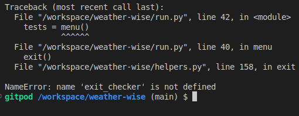
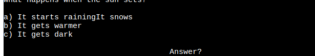
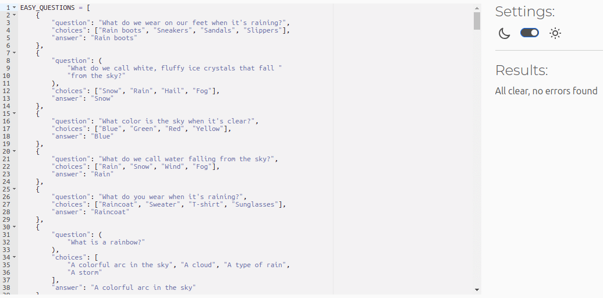

# Testing

> [!NOTE]  
> Return back to the [README.md](README.md) file.

Feature-by-Feature Testing:

- Navigation: Ensuring smooth transitions every time the program ran inputted character/s and that they showed the correct items afterwards.
- Portfolio Display: Verifying that projects are properly showcased with accurate descriptions and icons.

User Experience Testing:

- Usability Testing: I had users interact with the site and provide feedback. Document any issues encountered and the resolutions implemented.
1.
2.
3.

Compatibility Testing:

- Browser Compatibility: Tested on different browsers (Chrome, Firefox, Amazon silk, Edge, etc.) to ensure consistent performance.

Regression Testing:

After implementing fixes or updates, I ensured that previous features and functionalities still worked as intended, which prevents any new changes from breaking existing features.

Documentation and Logs:

| Issue notes | Issue image | Fix notes | Fix image |
| --- | --- | --- | --- |
| When trying to import my `remove` function a `ImportError` appeared informing me that a circular import might be the problem |  | To fix this problem I moved some of the imports inside the actual functions that required them |  |
| When trying to use my `exit_checker` function a `NameError` appeared informing me that the function wasn't defined |  | To fix this I had to import my `exit` function so that the `exit_checker` function would work |  |
| Whilst checking the program on the live site I noticed that the green tick icon on the correct answer part was slightly overlapping the text |  | To fix this issue I had to put a bigger gap between the icon and the text |  |
| When trying to use the `exit` function a `ImportError` appeared telling me that the `exit_checker` function inside the `exit` function was not defined |  | To fix this I had to import the `exit_checker` function from the checks.py file |  |
| When running the program on Heroku I received a `FileNotFoundError` because the creds.json file could not be found |  | To fix this I needed to add the file into Heroku's Config vars so that Heroku could detect it |  |
| When on the error section of the level choice picker I noticed that there was a green line that shouldn't have been there |  | To fix this style error I altered the styling slightly which stopped the green line appearing |  |
| Whilst on the Heroku site I noticed that some of the text and icons were too close to the edge of the program area |  | To fix this I put an empty print statement above the text and icons that required this to move them down one line |  |
| When on the Live site I noticed that the red stop icon sign was slightly overlapping the text making it difficult to read |  | To fix this issue I had to put a bigger gap between the icon and the text |  |
| When trying to import the `level_selector` function from the helpers.py file I received a `ImportError` |  | To fix this I had to import the function from the game.py file that it had been moved into |  |
| Whilst trying to import the `checkers` function from the helpers.py file I received a `ImportError` |  | To fix this I had to import the function from the checks.py file that it had been moved into |  |
| After altering the questions.py file so that it would pass the Pep8 validator without any errors I noticed that not all the choices appeared when the program was run after |  | To fix this I had to refactor the question.py file |  |
| Whilst checking the program on the live site I noticed that the red cross icon on the incorrect answer part was slightly overlapping the text |  | To fix this issue I had to put a bigger gap between the icon and the text |  |
| When first running the program the rules section would load after a few seconds of showing the menu screen |  | To fix this issue I had to refactor how the `menu` function called the `rules` function so that it would only allow the rules section to show when I user choose the option |  |
| When trying to style some text I received a `NameError` that the `RED_FOREGROUND` was not defined |  | To fix this issue I had to add the variable `RED_FOREGROUND` to the file so that it could be used |  |
| Whilst trying to add tabs to a print statement I received a `SyntaxError` |  | To fix this I removed one of the `\t` characters |  |
| Whilst trying to run the program I received a `TypeError` because the `questions_amount` function took 0 positional arguments but 1 was given |  | To fix this I needed to add an argument into the function as well as were it was called |  |
| When trying to run the program I received a `TypeError` because there was a unsupported format string |  | To fix this issue I added the styling inside the `loading_message` function that was being used instead |  |
| Whilst running the program on Heroku I noticed that some of the text was slightly difficult to see |  | To fix this I added styling that would brighten up the text that required it making it easier to read |  |

## Code Validation

### Python

I have used the recommended [PEP8 CI Python Linter](https://pep8ci.herokuapp.com) to validate all of my Python files.

| Directory | File | CI URL | Screenshot | Notes |
| --- | --- | --- | --- | --- |
|  | run.py | [PEP8 CI](https://pep8ci.herokuapp.com/https://raw.githubusercontent.com/AshLaw96/weather-wise/main/run.py) |  | no issues were found |
|  | game.py | [PEP8 CI](https://pep8ci.herokuapp.com/https://raw.githubusercontent.com/AshLaw96/weather-wise/main/game.py) |  | no issues were found | 
|  | helpers.py | [PEP8 CI](https://pep8ci.herokuapp.com/https://raw.githubusercontent.com/AshLaw96/weather-wise/main/helpers.py) |  | no issues were found |
|  | checks.py | [PEP8 CI](https://pep8ci.herokuapp.com/https://raw.githubusercontent.com/AshLaw96/weather-wise/main/checks.py) |  | no issues were found |
|  | questions.py | [PEP8 CI](https://pep8ci.herokuapp.com/https://raw.githubusercontent.com/AshLaw96/weather-wise/main/questions.py) |  | no issues were found |

## Browser Compatibility

I've tested my deployed project on multiple browsers to check for compatibility issues.

| Browser | Menu | Rules | Level | Amount | Quiz | Quit | Notes |
| --- | --- | --- | --- | --- | --- | --- | --- |
| Chrome |  |  |  |  |  |  | Works as expected |
| Firefox |  |  |  |  |  |  | Icons slightly cut off |
| Edge |  |  |  |  |  |  | Works as expected |
| Amazon silk |  |  |  |  |  |  | Works as expected |

## Defensive Programming

Defensive programming was manually tested with the below user acceptance testing:

| Page | Expectation | Test | Result | Fix | Screenshot |
| --- | --- | --- | --- | --- | --- |
| Menu | | | | | |
| | Feature is expected to do X when the user does Y | Tested the feature by doing Y | The feature behaved as expected, and it did Y | Test concluded and passed |  |
| | Feature is expected to do X when the user does Y | Tested the feature by doing Y | The feature did not respond to A, B, or C. | I did Z to the code because something was missing |  |
| Rules | | | | | |
| | Feature is expected to do X when the user does Y | Tested the feature by doing Y | The feature behaved as expected, and it did Y | Test concluded and passed |  |
| | Feature is expected to do X when the user does Y | Tested the feature by doing Y | The feature did not respond to A, B, or C. | I did Z to the code because something was missing |  |
| Level | | | | | |
| | Feature is expected to do X when the user does Y | Tested the feature by doing Y | The feature behaved as expected, and it did Y | Test concluded and passed |  |
| | Feature is expected to do X when the user does Y | Tested the feature by doing Y | The feature did not respond to A, B, or C. | I did Z to the code because something was missing |  |
| Amount | | | | | |
| | Feature is expected to do X when the user does Y | Tested the feature by doing Y | The feature behaved as expected, and it did Y | Test concluded and passed |  |
| | Feature is expected to do X when the user does Y | Tested the feature by doing Y | The feature did not respond to A, B, or C. | I did Z to the code because something was missing |  |
| Quiz | | | | | |
| | Feature is expected to do X when the user does Y | Tested the feature by doing Y | The feature behaved as expected, and it did Y | Test concluded and passed |  |
| | Feature is expected to do X when the user does Y | Tested the feature by doing Y | The feature did not respond to A, B, or C. | I did Z to the code because something was missing |  |
| Scoring | | | | | |
| | Feature is expected to do X when the user does Y | Tested the feature by doing Y | The feature behaved as expected, and it did Y | Test concluded and passed |  |
| | Feature is expected to do X when the user does Y | Tested the feature by doing Y | The feature did not respond to A, B, or C. | I did Z to the code because something was missing |  |
| Quit | | | | | |
| | Feature is expected to do X when the user does Y | Tested the feature by doing Y | The feature behaved as expected, and it did Y | Test concluded and passed |  |
| | Feature is expected to do X when the user does Y | Tested the feature by doing Y | The feature did not respond to A, B, or C. | I did Z to the code because something was missing |  |

## User Story Testing

| User Story | Screenshot |
| --- | --- |
| As a new site user, I would like to be able to know what the program does, so that I can quickly decide if I want to continue. |  |
| As a new site user, I would like to know how to play the quiz, so that I can easily understand what I need to do and start playing. |  |
| As a new site user, I would like to choose how hard the quiz is, so that I can challenge myself with harder questions. |  |
| As a new site user, I would like to choose the amount of questions I get asked, so that I don't get bored. |  |
| As a new site user, I would like to keep playing the game as many times as I want, so that I can keep learning interesting facts about the weather. |  |
| --- | --- |
| As a returning site user, I would like to be able to try answering any question again if I didn't input one of the given options, so that I can my score isn't effected because of this. |  |
| As a returning site user, I would like to be able to see my high score, so that I can try and beat it and improve my knowledge. |  |
| As a returning site user, I would like to have different questions asked, so that I'm not repeating the same questions every time I play. |  |
| As a returning site user, I would like to see different icons or images, so that I can be visually pleased whilst learning cool facts at the same time. |  |
| As a returning site user, I would like to see other peoples high score, so that I can try and get on the top of the leaderboard. |  |
| --- | --- |
| As a site administrator, I should be able to see how many people play each difficulty, so that I can add more of the specific level question if needed. |  |
| As a site administrator, I should be able to view the load speed of the site, so that I can improve where necessary. |  |
| As a site administrator, I should be able to see how many people use the program, so that I can try to improve the program and gain more users if needed. |  |

## Bugs

### GitHub **Issues**

**Fixed Bugs**

All previously closed/fixed bugs can be tracked [here](https://github.com/AshLaw96/weather-wise/issues?q=is%3Aissue+is%3Aclosed).

| Bug | Status |
| --- | --- |
| [Python NameError: name `RED_FOREGROUND` is not defined](https://github.com/AshLaw96/weather-wise/issues/1) | Closed |
| [Python SyntaxError: invalid syntax](https://github.com/AshLaw96/weather-wise/issues/2) | Closed |
| [Showing rules when it shouldn't](https://github.com/AshLaw96/weather-wise/issues/3) | Closed |
| [Python NameError: name `exit_checker` is not defined](https://github.com/AshLaw96/weather-wise/issues/4) | Closed  |
| [Showing green line in `level_selector` error section](https://github.com/AshLaw96/weather-wise/issues/5) | Closed  |
| [Python TypeError: `questions_amount()` takes 0 positional arguments but 1 was given](https://github.com/AshLaw96/weather-wise/issues/6) | Closed  |
| [Text slight visibility issue](https://github.com/AshLaw96/weather-wise/issues/7) | Closed  |
| [Text/icon too high](https://github.com/AshLaw96/weather-wise/issues/8) | Closed  |
| [Icons slight overlap of text](https://github.com/AshLaw96/weather-wise/issues/9) | Closed  |
| [Python FileNotFoundError: [Errno 2] No such file or directory: `creds.json`](https://github.com/AshLaw96/weather-wise/issues/10) | Closed  |
| [Python ImportError: cannot import name `checker` from `helpers`](https://github.com/AshLaw96/weather-wise/issues/11) | Closed  |
| [Python NameError: name `exit_checker` is not defined](https://github.com/AshLaw96/weather-wise/issues/12) | Closed  |
| [Python ImportError: cannot import name `level_selector` from `helpers`](https://github.com/AshLaw96/weather-wise/issues/13) | Closed  |
| [Python ImportError: cannot import name `remove` from partially initialised module `helpers` (most likely due to a circular import)](https://github.com/AshLaw96/weather-wise/issues/14) | Closed  |
| [Python TypeError: unsupported format string passed to `NoneType.__format__`](https://github.com/AshLaw96/weather-wise/issues/15) | Closed  |
| [Showing incorrect amount of choices](https://github.com/AshLaw96/weather-wise/issues/16) | Closed  |
| [Icon slight overlap of text](https://github.com/AshLaw96/weather-wise/issues/17) | Closed |

> [!NOTE]
> There are no remaining bugs that I am aware of.
