# Testing

> [!NOTE]  
> Return back to the [README.md](README.md) file.

Feature-by-Feature Testing:

- Navigation: Ensuring smooth transitions every time the program ran inputted character/s and that they showed the correct items afterwards.
- Portfolio Display: Verifying that projects are properly showcased with accurate descriptions and icons.

User Experience Testing:

- Usability Testing: I had users interact with the site and provide feedback. Document any issues encountered and the resolutions implemented.
1.
2.
3.

Compatibility Testing:

- Browser Compatibility: Tested on different browsers (Chrome, Firefox, Amazon silk, Edge, etc.) to ensure consistent performance.

Regression Testing:

After implementing fixes or updates, I ensured that previous features and functionalities still worked as intended, which prevents any new changes from breaking existing features.

Documentation and Logs:

| Issue notes | Issue image | Fix notes | Fix image |
| --- | --- | --- | --- |
| When trying to import my `remove` function a `ImportError` appeared informing me that a circular import might be the problem |  | To fix this problem I moved some of the imports inside the actual functions that required them | 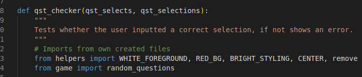 |
| When trying to use my `exit_checker` function a `NameError` appeared informing me that the function wasn't defined |  | To fix this I had to import my `exit` function so that the `exit_checker` function would work |  |
| Whilst checking the program on the live site I noticed that the green tick icon on the correct answer part was slightly overlapping the text |  | To fix this issue I had to put a bigger gap between the icon and the text |  |
| When trying to use the `exit` function a `ImportError` appeared telling me that the `exit_checker` function inside the `exit` function was not defined |  | To fix this I had to import the `exit_checker` function from the checks.py file |  |
| When running the program on Heroku I received a `FileNotFoundError` because the creds.json file could not be found |  | To fix this I needed to add the file into Heroku's Config vars so that Heroku could detect it | 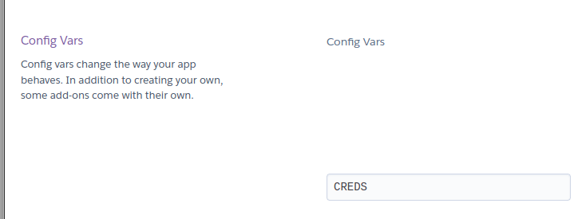 |
| When on the error section of the level choice picker I noticed that there was a green line that shouldn't have been there |  | To fix this style error I altered the styling slightly which stopped the green line appearing |  |
| Whilst on the Heroku site I noticed that some of the text and icons were too close to the edge of the program area |  | To fix this I put an empty print statement above the text and icons that required this to move them down one line |  |
| When on the Live site I noticed that the red stop icon sign was slightly overlapping the text making it difficult to read |  | To fix this issue I had to put a bigger gap between the icon and the text |  |
| When trying to import the `level_selector` function from the helpers.py file I received a `ImportError` |  | To fix this I had to import the function from the game.py file that it had been moved into |  |
| Whilst trying to import the `checkers` function from the helpers.py file I received a `ImportError` |  | To fix this I had to import the function from the checks.py file that it had been moved into |  |
| After altering the questions.py file so that it would pass the Pep8 validator without any errors I noticed that not all the choices appeared when the program was run after |  | To fix this I had to refactor the question.py file |  |
| Whilst checking the program on the live site I noticed that the red cross icon on the incorrect answer part was slightly overlapping the text |  | To fix this issue I had to put a bigger gap between the icon and the text |  |
| When first running the program the rules section would load after a few seconds of showing the menu screen | 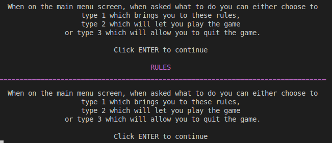 | To fix this issue I had to refactor how the `menu` function called the `rules` function so that it would only allow the rules section to show when I user choose the option |  |
| When trying to style some text I received a `NameError` that the `RED_FOREGROUND` was not defined |  | To fix this issue I had to add the variable `RED_FOREGROUND` to the file so that it could be used |  |
| Whilst trying to add tabs to a print statement I received a `SyntaxError` |  | To fix this I removed one of the `\t` characters |  |
| Whilst trying to run the program I received a `TypeError` because the `questions_amount` function took 0 positional arguments but 1 was given |  | To fix this I needed to add an argument into the function as well as were it was called |  |
| When trying to run the program I received a `TypeError` because there was a unsupported format string |  | To fix this issue I added the styling inside the `loading_message` function that was being used instead |  |
| Whilst running the program on Heroku I noticed that some of the text was slightly difficult to see |  | To fix this I added styling that would brighten up the text that required it making it easier to read | 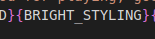 |
| When running the program on the live site, I noticed that there was no whitespace between the full-stop and please word on the error validation message of the quiz section |  | To fix this issue I had to put a space between the double quotation marks and the please word |  |

## Code Validation

### Python

I have used the recommended [PEP8 CI Python Linter](https://pep8ci.herokuapp.com) to validate all of my Python files.

| Directory | File | CI URL | Screenshot | Notes |
| --- | --- | --- | --- | --- |
|  | run.py | [PEP8 CI](https://pep8ci.herokuapp.com/https://raw.githubusercontent.com/AshLaw96/weather-wise/main/run.py) |  | no issues were found |
|  | game.py | [PEP8 CI](https://pep8ci.herokuapp.com/https://raw.githubusercontent.com/AshLaw96/weather-wise/main/game.py) | 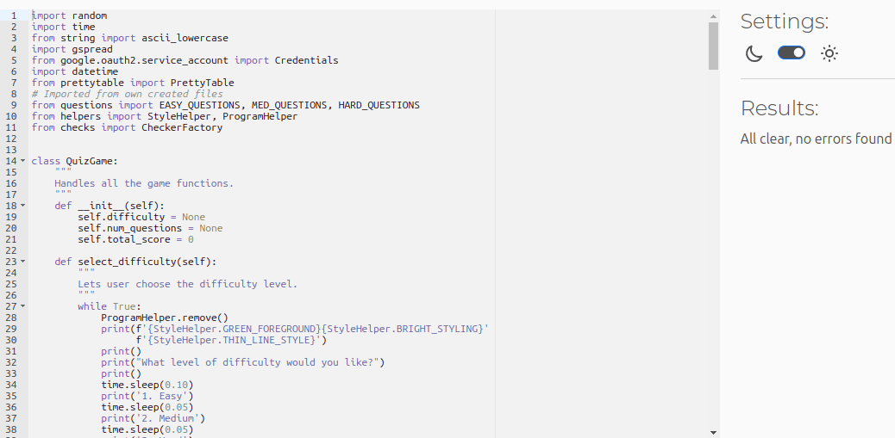 | no issues were found | 
|  | helpers.py | [PEP8 CI](https://pep8ci.herokuapp.com/https://raw.githubusercontent.com/AshLaw96/weather-wise/main/helpers.py) |  | no issues were found |
|  | checks.py | [PEP8 CI](https://pep8ci.herokuapp.com/https://raw.githubusercontent.com/AshLaw96/weather-wise/main/checks.py) | 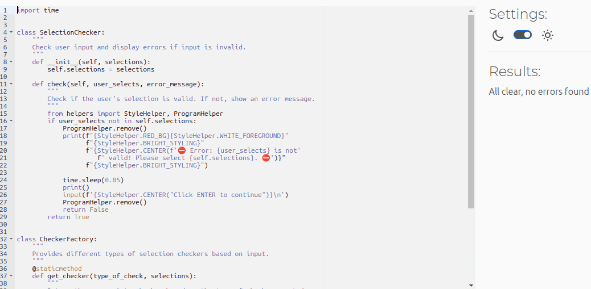 | no issues were found |
|  | questions.py | [PEP8 CI](https://pep8ci.herokuapp.com/https://raw.githubusercontent.com/AshLaw96/weather-wise/main/questions.py) |  | no issues were found |

## Browser Compatibility

I've tested my deployed project on multiple browsers to check for compatibility issues.

| Browser | Menu | Rules | Level | Amount | Quiz | Quit | Notes |
| --- | --- | --- | --- | --- | --- | --- | --- |
| Chrome |  |  |  |  |  |  | Works as expected |
| Firefox | 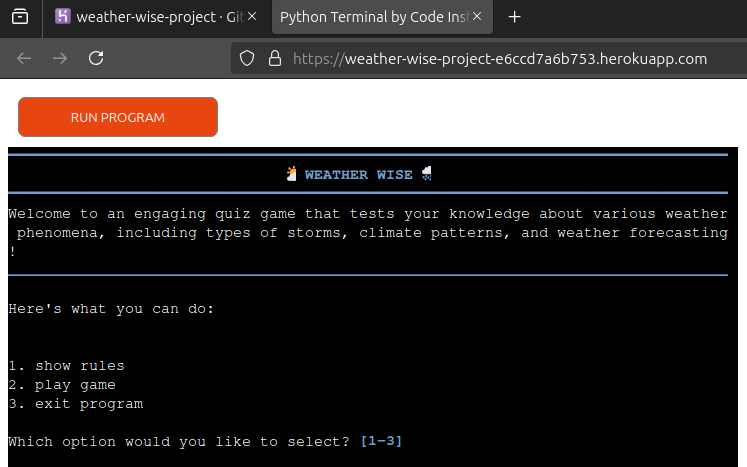 |  |  |  |  |  | Icons slightly cut off |
| Edge |  |  |  |  |  |  | Works as expected |
| Amazon silk |  |  |  |  |  |  | Works as expected |

## Defensive Programming

Defensive programming was manually tested with the below user acceptance testing:

| Page | Expectation | Test | Result | Fix | Screenshot |
| --- | --- | --- | --- | --- | --- |
| Menu | | | | | |
| | When the user inputs 1 the program is expected to go to the rules section | I tested the feature by inputting 1 on different browsers and devices | The feature behaved as expected, and it went to the rules section | Test concluded and passed |  |
| | When the user inputs 2 the program is expected to go to the level choices section | I tested the feature by inputting 2 on different browsers and devices | The feature behaved as expected, and it went to the level choice section | Test concluded and passed |  |
| | When the user inputs 3 the program is expected to go to the exit section | I tested the feature by inputting 3 on different browsers and devices | The feature behaved as expected, and it went to the exit section | Test concluded and passed |  |
| | When the user inputs wrong number the program is expected to go to the error validator section | I tested the feature by inputting many different numbers on different browsers and devices | The feature behaved as expected, and it went to the error validator section | Test concluded and passed  |  |
| | When the user inputs wrong letter the program is expected to go to the error validator section | I tested the feature by inputting different letters on different browsers and devices | The feature behaved as expected, and it went to the error validator section | Test concluded and passed  |  |
| | When the user inputs a word the program is expected to go to the error validator section | I tested the feature by inputting different words on different browsers and devices | The feature behaved as expected, and it went to the error validator section | Test concluded and passed |  |
| | When the user just clicks enter the program is expected to go to the error section | I tested the feature by just clicking enter on different browsers and devices | The feature behaved as expected, and it went to the rules section | Test concluded and passed |  |
| | When the user inputs the wrong numbers the program is expected to go to the error validator section | I tested the feature by inputting many different numbers on different browsers and devices | The feature behaved as expected, and it went to the error validator section | Test concluded and passed | 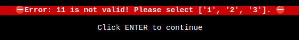 |
| Rules | | | | | |
| | When the user clicks enter the program is expected to show the next bit of rules and remove the previous ones and when the user is on the last bit of rules and they press enter it should return them to the main menu | I tested the feature by clicking enter on multiple devices and browsers | The feature behaved as expected, and it showed each paragraph of rules and removed the previous one when enter was clicked until it reached the end, where it returned the the main menu | Test concluded and passed |  |
| | When the user enters any letter or letters then press enter the program is expected to show the rules and remove any letter or letters until it reaches the end of the rules then it will return to the main menu | Tested the feature by typing different letters and words on a variety of devices and browsers | The feature behaved as expected and ran through the rules section and removed any letters or words inputted each time enter was clicked until reaching the end where it returned to the main menu | Test concluded and passed | 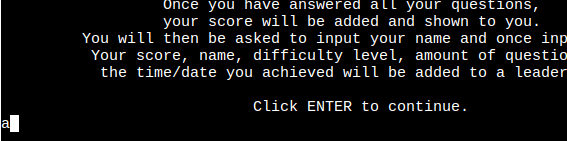 / 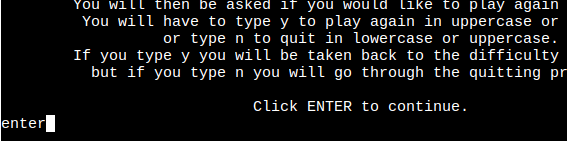 |
| | When the user enters any number or numbers then press enter, the program is expected to show the rules and remove any number or numbers until it reaches the end of the rules then it will return to the main menu | Tested the feature by typing different numbers on a variety of devices and browsers | The feature behaved as expected and ran through the rules section and removed any numbers inputted each time enter was clicked until reaching the end where it returned to the main menu | Test concluded and passed | 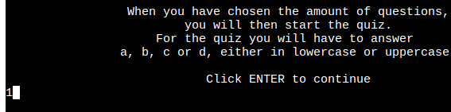 / 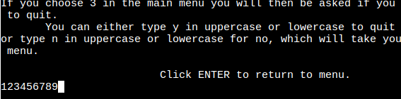 |
| Level | | | | | |
| | When the user inputs 1 the program is expected to go to the amount section and get the questions from the `EASY_QUESTIONS` variable ready for the quiz section | I tested the feature by inputting 1 on different browsers and devices | The feature behaved as expected, and it went to the amount section and got questions from the `EASY_QUESTIONS` variable | Test concluded and passed |  |
| | When the user inputs 2 the program is expected to go to the amount section and get the questions from the `MED_QUESTIONS` variable ready for the quiz section | I tested the feature by inputting 2 on different browsers and devices | The feature behaved as expected, and it went to the amount section and got questions from the `MED_QUESTIONS` variable | Test concluded and passed |  |
| | When the user inputs 3 the program is expected to go to the amount section and get the questions from the `HARD_QUESTIONS` variable ready for the quiz section | I tested the feature by inputting 3 on different browsers and devices | The feature behaved as expected, and it went to the amount section and got questions from the `HARD_QUESTIONS` variable | Test concluded and passed |  |
| | When the user inputs wrong number the program is expected to go to the error validator section | I tested the feature by inputting many different numbers on different browsers and devices | The feature behaved as expected, and it went to the error validator section section | Test concluded and passed |  |
| | When the user inputs wrong letter the program is expected to go to the error validator section | I tested the feature by inputting different letters on different browsers and devices | The feature behaved as expected, and it went to the error validator section | Test concluded and passed  |  |
| | When the user inputs a word the program is expected to go to the error validator section | I tested the feature by inputting different words on different browsers and devices | The feature behaved as expected, and it went to the error validator section | Test concluded and passed |  |
| | When the user just clicks enter the program is expected to go to the error section | I tested the feature by just clicking enter on different browsers and devices | The feature behaved as expected, and it went to the rules section | Test concluded and passed |  |
| | When the user inputs the wrong numbers the program is expected to go to the error validator section | I tested the feature by inputting many different numbers on different browsers and devices | The feature behaved as expected, and it went to the error validator section | Test concluded and passed |  |
| Amount | | | | | |
| | When the user inputs 1 the program is expected to go to the quiz section and get 10 questions from the previous chosen level of questions | I tested the feature by inputting 1 on different browsers and devices | The feature behaved as expected, and it went to the quiz section and got 10 questions from the previously chosen level of questions | Test concluded and passed |  |
| | When the user inputs 2 the program is expected to go to the quiz section and get 20 questions from the previously chosen level of questions | I tested the feature by inputting 2 on different browsers and devices | The feature behaved as expected, and it went to the quiz section and got 20 questions from the previously chosen level of questions | Test concluded and passed | 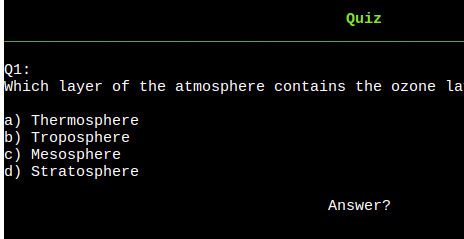 |
| | When the user inputs 3 the program is expected to go to the quiz section and get 30 questions from the previously chosen level of questions | I tested the feature by inputting 3 on different browsers and devices | The feature behaved as expected, and it went to the quiz section and got 30 questions from the previously chosen level of questions | Test concluded and passed |  |
| | When the user inputs wrong number the program is expected to go to the error validator section | I tested the feature by inputting many different numbers on different browsers and devices | The feature behaved as expected, and it went to the error validator section | Test concluded and passed |  |
| | When the user inputs wrong letter the program is expected to go to the error validator section | I tested the feature by inputting different letters on different browsers and devices | The feature behaved as expected, and it went to the error validator section | Test concluded and passed |  |
| | When the user inputs a word the program is expected to go to the error validator section | I tested the feature by inputting different words on different browsers and devices | The feature behaved as expected, and it went to the error validator section | Test concluded and passed |  |
| | When the user just clicks enter the program is expected to go to the error section | I tested the feature by just clicking enter on different browsers and devices | The feature behaved as expected, and it went to the rules section | Test concluded and passed |  |
| | When the user inputs the wrong numbers the program is expected to go to the error validator section | I tested the feature by inputting many different numbers on different browsers and devices | The feature behaved as expected, and it went to the error validator section | Test concluded and passed |  |
| Quiz | | | | | |
| | When the user inputs a/A, b/B, c/C or d/D the program is expected to check if the users choice is wrong or right. If wrong it should show the wrong message and if right should show the right message | I tested the feature by inputting the letters in both uppercase and lowercase on different browsers and devices | The feature behaved as expected, and it showed the wrong message when a incorrect answer was inputted and the correct message when a correct answer was inputted | Test concluded and passed |  |
| | When the user inputs a correct answer the program is expected to show the right message | I tested the feature by inputting the correct answer for different questions on different browsers and devices | The feature behaved as expected, and it showed the correct message when a correct answer was inputted | Test concluded and passed |  |
| | When the user inputs a correct answer the program is expected to show the right message | I tested the feature by inputting the incorrect answer for different questions on different browsers and devices | The feature behaved as expected, and it showed the wrong message when a incorrect answer was inputted | Test concluded and passed |  |
| | When the user inputs wrong number the program is expected to show an error message | I tested the feature by inputting many different numbers on different browsers and devices | The feature behaved as expected, and it showed an error message | Test concluded and passed |  |
| | When the user inputs wrong letter the program is expected to go to the error validator section | I tested the feature by inputting different letters on different browsers and devices | The feature behaved as expected, and it went to the error validator section | Test concluded and passed |  |
| | When the user inputs a word the program is expected to go to the error validator section | I tested the feature by inputting different words on different browsers and devices | The feature behaved as expected, and it went to the error validator section | Test concluded and passed |  |
| | When the user just clicks enter the program is expected to go to the error section | I tested the feature by just clicking enter on different browsers and devices | The feature behaved as expected, and it went to the rules section | Test concluded and passed |  |
| | When the user inputs the wrong numbers the program is expected to go to the error validator section | I tested the feature by inputting many different numbers on different browsers and devices | The feature behaved as expected, and it went to the error validator section | Test concluded and passed | 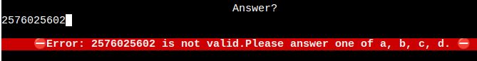 |
| Scoring | | | | | |
| | When the user finishes the quiz it should show a there score with a specific message depending on the percentage they scored | Tested the feature by achieving different amount of scoring results on different devices and browsers | The feature behaved as expected, and showed the correct score message depending on the total correct answers | Test concluded and passed |  /  /  /  |
| | After the users score is given it will then ask the user to input their name after this it should add their name, score, amount of questions and a timestamp of when it was completed into the correct level leaderboard | Tested the feature by typing my name when asked to do so, on different devices and browsers | The feature behaved as expected, and added the name, score, amount of questions and a timestamp of when it was completed into the correct level leaderboard | Test concluded and passed | 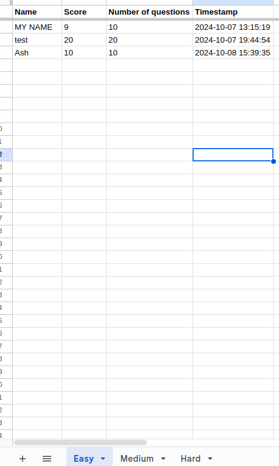 |
| | When the user inputs Y/y they should be taken back to the level choice section | I tested the feature by typing y in uppercase and lowercase on different devices and browsers | The feature behaved as expected, and returned to the level choice section | Test concluded and passed |  |
| | When the user inputs N/n they should be taken to the quitting section | I tested the feature by typing n in uppercase and lowercase on different devices and browsers | The feature behaved as expected, and went to the quit section | Test concluded and passed |  |
| | When the user inputs wrong number the program is expected to go to the error validator section | I tested the feature by inputting many different numbers on different browsers and devices | The feature behaved as expected, and it went to the error validator section | Test concluded and passed |  |
| | When the user inputs wrong letter the program is expected to go to the error validator section | I tested the feature by inputting different letters on different browsers and devices | The feature behaved as expected, and it went to the error validator section | Test concluded and passed |  |
| | When the user inputs a word the program is expected to go to the error validator section | I tested the feature by inputting different words on different browsers and devices | The feature behaved as expected, and it went to the error validator section | Test concluded and passed |  |
| | When the user just clicks enter the program is expected to go to the error section | I tested the feature by just clicking enter on different browsers and devices | The feature behaved as expected, and it went to the rules section | Test concluded and passed |  |
| | When the user inputs the wrong numbers the program is expected to go to the error validator section | I tested the feature by inputting many different numbers on different browsers and devices | The feature behaved as expected, and it went to the error validator section | Test concluded and passed |  |
| Quit | | | | | |
| | When the user inputs Y/y into the program it should then show a goodbye message and stop the program | I tested the feature by typing y in uppercase and lowercase on different devices and browsers | The feature behaved as expected, and it showed the goodbye message and closed the program | Test concluded and passed |  |
| | When the user inputs N/n they should be returned to the menu section | I tested the feature by typing n in uppercase and lowercase on different devices and browsers | The feature behaved as expected, and returned to the menu section | Test concluded and passed |  |
| | When the user inputs wrong number the program is expected to show an error message | I tested the feature by inputting many different numbers on different browsers and devices | The feature behaved as expected, and it showed an error message | Test concluded and passed |  |
| | When the user inputs wrong letter the program is expected to go to the error validator section | I tested the feature by inputting different letters on different browsers and devices | The feature behaved as expected, and it went to the error validator section | Test concluded and passed |  |
| | When the user inputs a word the program is expected to go to the error validator section | I tested the feature by inputting different words on different browsers and devices | The feature behaved as expected, and it went to the error validator section | Test concluded and passed |  |
| | When the user just clicks enter the program is expected to go to the error section | I tested the feature by just clicking enter on different browsers and devices | The feature behaved as expected, and it went to the rules section | Test concluded and passed |  |
| | When the user inputs the wrong numbers the program is expected to go to the error validator section | I tested the feature by inputting many different numbers on different browsers and devices | The feature behaved as expected, and it went to the error validator section | Test concluded and passed |  |

## User Story Testing

| User Story | Screenshot |
| --- | --- |
| As a new site user, I would like to be able to know what the program does, so that I can quickly decide if I want to continue. |  |
| As a new site user, I would like to know how to play the quiz, so that I can easily understand what I need to do and start playing. |  |
| As a new site user, I would like to choose how hard the quiz is, so that I can challenge myself with harder questions. |  |
| As a new site user, I would like to choose the amount of questions I get asked, so that I don't get bored. |  |
| As a new site user, I would like to keep playing the game as many times as I want, so that I can keep learning interesting facts about the weather. |  |
| --- | --- |
| As a returning site user, I would like to be able to try answering any question again if I didn't input one of the given options, so that I can my score isn't effected because of this. |  |
| As a returning site user, I would like to be able to see my high score, so that I can try and beat it and improve my knowledge. |  |
| As a returning site user, I would like to have different questions asked, so that I'm not repeating the same questions every time I play. |  |
| As a returning site user, I would like to see different icons or images, so that I can be visually pleased whilst learning cool facts at the same time. |  |
| As a returning site user, I would like to see other peoples high score, so that I can try and get on the top of the leaderboard. |  |
| --- | --- |
| As a site administrator, I should be able to see how many people play each difficulty, so that I can add more of the specific level question if needed. |  |
| As a site administrator, I should be able to view the load speed of the site, so that I can improve where necessary. |  |
| As a site administrator, I should be able to see how many people use the program, so that I can try to improve the program and gain more users if needed. |  |

## Bugs

### GitHub **Issues**

**Fixed Bugs**

All previously closed/fixed bugs can be tracked [here](https://github.com/AshLaw96/weather-wise/issues?q=is%3Aissue+is%3Aclosed).

| Bug | Status |
| --- | --- |
| [Python NameError: name `RED_FOREGROUND` is not defined](https://github.com/AshLaw96/weather-wise/issues/1) | Closed |
| [Python SyntaxError: invalid syntax](https://github.com/AshLaw96/weather-wise/issues/2) | Closed |
| [Showing rules when it shouldn't](https://github.com/AshLaw96/weather-wise/issues/3) | Closed |
| [Python NameError: name `exit_checker` is not defined](https://github.com/AshLaw96/weather-wise/issues/4) | Closed  |
| [Showing green line in `level_selector` error section](https://github.com/AshLaw96/weather-wise/issues/5) | Closed  |
| [Python TypeError: `questions_amount()` takes 0 positional arguments but 1 was given](https://github.com/AshLaw96/weather-wise/issues/6) | Closed  |
| [Text slight visibility issue](https://github.com/AshLaw96/weather-wise/issues/7) | Closed  |
| [Text/icon too high](https://github.com/AshLaw96/weather-wise/issues/8) | Closed  |
| [Icons slight overlap of text](https://github.com/AshLaw96/weather-wise/issues/9) | Closed  |
| [Python FileNotFoundError: [Errno 2] No such file or directory: `creds.json`](https://github.com/AshLaw96/weather-wise/issues/10) | Closed  |
| [Python ImportError: cannot import name `checker` from `helpers`](https://github.com/AshLaw96/weather-wise/issues/11) | Closed  |
| [Python NameError: name `exit_checker` is not defined](https://github.com/AshLaw96/weather-wise/issues/12) | Closed  |
| [Python ImportError: cannot import name `level_selector` from `helpers`](https://github.com/AshLaw96/weather-wise/issues/13) | Closed  |
| [Python ImportError: cannot import name `remove` from partially initialised module `helpers` (most likely due to a circular import)](https://github.com/AshLaw96/weather-wise/issues/14) | Closed  |
| [Python TypeError: unsupported format string passed to `NoneType.__format__`](https://github.com/AshLaw96/weather-wise/issues/15) | Closed  |
| [Showing incorrect amount of choices](https://github.com/AshLaw96/weather-wise/issues/16) | Closed  |
| [Icon slight overlap of text](https://github.com/AshLaw96/weather-wise/issues/17) | Closed |
| [No whitespace between full-stop and please word](https://github.com/AshLaw96/weather-wise/issues/18) | Closed |

> [!NOTE]
> There are no remaining bugs that I am aware of.
